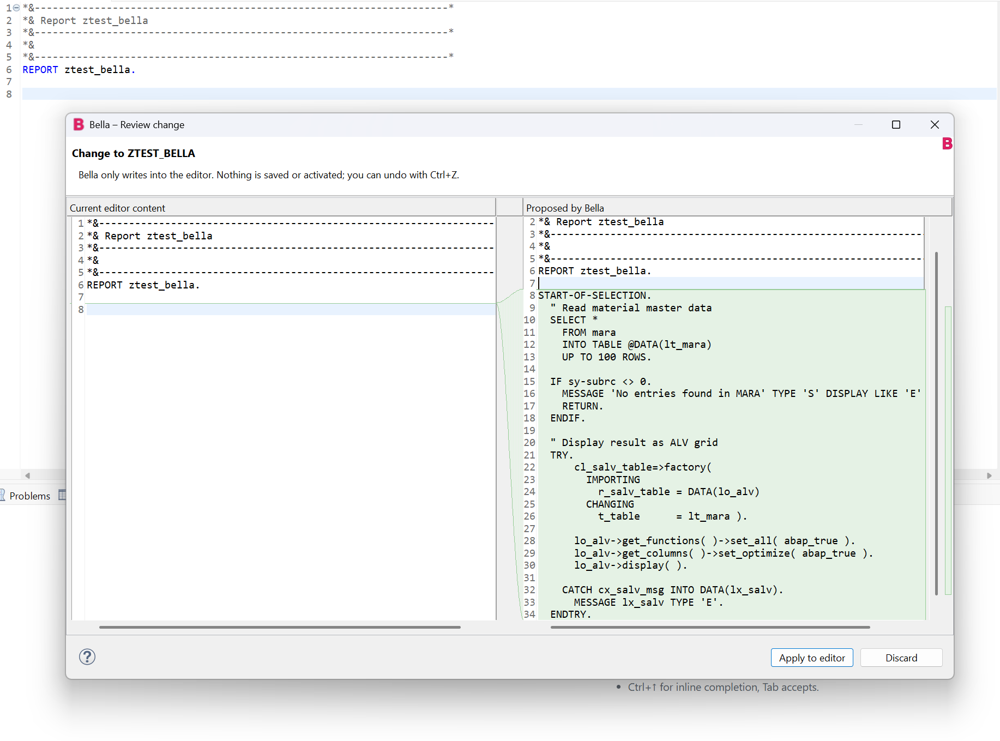
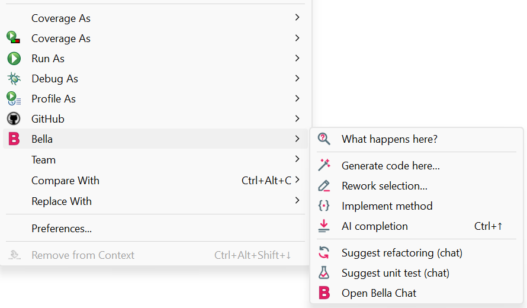
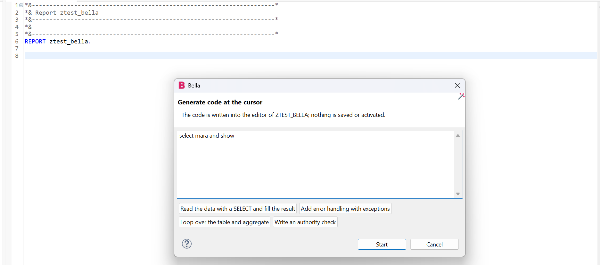
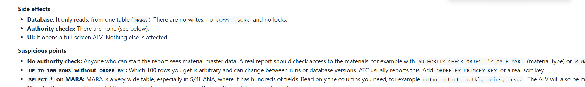
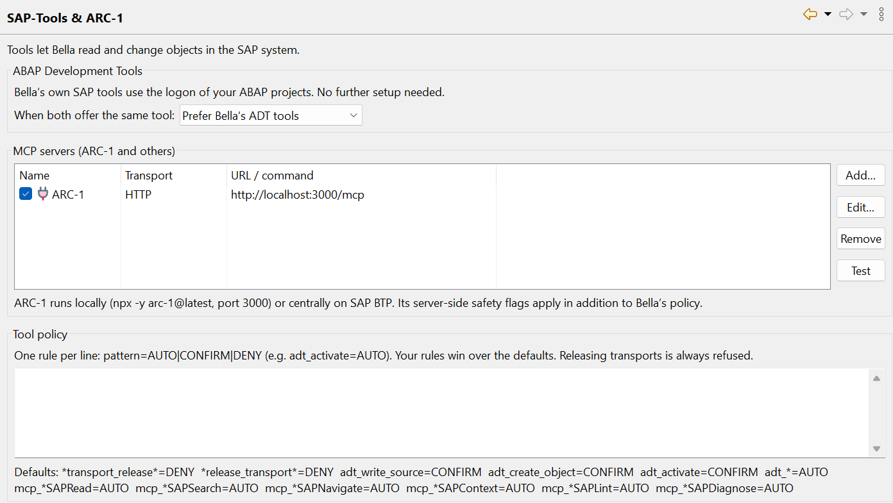
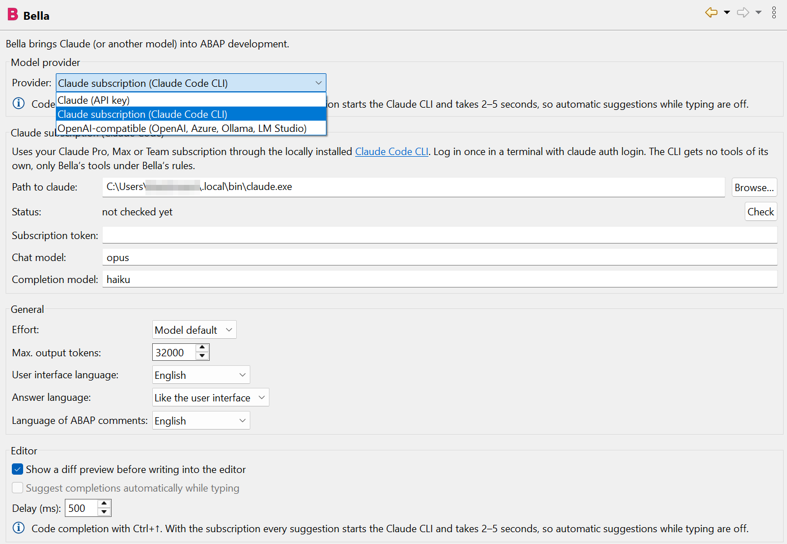

<p align="center"></p>

# Bella – AI assistant for ABAP in Eclipse

Bella brings Claude into the SAP ABAP Development Tools (ADT). You can use it with an API key, **with your Claude subscription**, **with your GitHub Copilot subscription**, or with another model through an OpenAI-compatible endpoint.

- Explain code: right-click → *What happens here?*
- Chat with the code in your editor as context
- Generate code, rework a selection or implement a method, written **into the editor only**
- Inline AI completion as ghost text

Bella reaches the SAP system through your existing ADT logon. ARC-1 or any other MCP server can be added. The user interface is available in 14 languages.

<p align="center"></p>

## Features

| | Feature | Where |
|---|---|---|
|  | **What happens here?** Explains the selection or, without a selection, the method at the cursor | Right-click in the editor → Bella |
|  | **Generate code here…** Writes code at the cursor position | Right-click → Bella |
|  | **Rework selection…** Fix errors, modern syntax, ABAP Cloud, performance, comments | Right-click → Bella |
|  | **Implement method** Writes the body of the METHOD/FORM/FUNCTION at the cursor | Right-click → Bella |
|  | **AI completion** as grey ghost text; Tab accepts, Esc dismisses | `Ctrl+↑` (macOS: `Cmd+Option+Enter`), or automatically while typing (not with the Claude subscription or GitHub Copilot) |
|  | **Suggest refactoring / unit test** | Right-click → Bella (chat) |
|  | **Chat** with editor context, streaming and tool calls; insert code blocks, replace the selection or take them over as a method body | `Ctrl+Alt+B`, pink B in the toolbar, menu *Bella* |
|  | **SAP tools**: search, read, where-used, syntax check (also for unsaved code), ABAP Unit, ATC, write, create, activate | automatically in the chat |

<p align="center"></p>

**Changing shortcuts:** *Preferences → General → Keys*, filter for "Bella". `Ctrl+↑` only applies in editors Bella is attached to and replaces "Scroll Line Up" there. Bella does not use `Ctrl+Alt+Space`, because the Claude desktop app takes it for its quick entry on Windows.

<table>
<tr>
<td width="50%"><br><sub><b>Generate code at the cursor.</b> Describe what you need or pick a suggestion.</sub></td>
<td width="50%"><br><sub><b>What happens here?</b> The explanation also lists side effects and suspicious points, here a missing authority check.</sub></td>
</tr>
</table>

### Ground rule: open objects are only changed in the editor

- **Code for an open method or class goes only into the Eclipse editor**, never directly into the SAP system. The editor holds the lock on the object.
  - A diff preview first shows old and new side by side (can be switched off).
  - Afterwards the editor is dirty: nothing is saved or activated. `Ctrl+Z` undoes the change.
  - You save and activate as usual with `Ctrl+S` and `Ctrl+F3`.
- If Claude tries to change an open object through a tool in the chat, Bella's **router** redirects the write into the editor.
- **Objects that are not open** may be written, created and activated in the SAP system, after you confirm.

## Architecture: who calls whom

<p align="center"></p>

1. and 2. Bella reads the source from the ADT editor and writes suggestions only into its buffer.
3. **Only Bella calls the model.** Prompt, code context and tool list go out; text and `tool_use` requests come back. With the Claude subscription or GitHub Copilot, the local Claude Code CLI or Copilot CLI makes this call for Bella.
4. Optionally Bella runs tool requests through ARC-1 or another MCP server.
5. Tools reach the SAP system in one of two ways:
   - **5a (default):** Bella's own `adt_*` tools use the ADT communication layer with the logon of your ABAP projects, including SSO. There is no second logon and no extra process.
   - **5b (optional):** ARC-1 talks to the SAP system and adds audit, rate limits and a package allowlist.
6. You save and activate open objects yourself in ADT.

**The model never talks to the SAP system directly.** Your system does not need to be reachable from the internet.

<p align="center"></p>

### Tool policy

| Tool | Default |
|---|---|
| Read (`adt_search_objects`, `adt_read_source`, `adt_where_used`, `adt_syntax_check`, `adt_run_unit_tests`, `adt_atc_check`; ARC-1: SAPRead, SAPSearch, …) | runs automatically |
| Write, create, activate (`adt_write_source`, `adt_create_object`, `adt_activate`; ARC-1: SAPWrite, SAPActivate, …) | asks first |
| Release transports | always refused |

- Add your own rules under *Preferences → Bella → SAP-Tools & ARC-1*, one per line as `pattern=AUTO|CONFIRM|DENY`.
- With ARC-1, its server-side safety flags apply in addition.

<p align="center"></p>

## Installation

Requirements:
- Eclipse 2024-12 or newer with Java 21
- SAP ABAP Development Tools
- on Linux also WebKitGTK (`libwebkit2gtk-4.1`) for the chat

**From the update site (recommended):**

1. In Eclipse: *Help → Install New Software… → Add…*, name *Bella*, location:
   ```
   https://bella.kilian-taubmann.de/
   ```
2. Install both features:
   - **Bella**: chat, editor actions, completion, MCP/ARC-1.
   - **Bella ADT integration**: Bella's own SAP tools through the ADT logon. Requires ADT.
3. Restart Eclipse. New versions then arrive through *Help → Check for Updates*.

**From a ZIP (offline):** download `bella-update-site-vX.Y.Z.zip` from [Releases](https://github.com/ktaubmann/Bella/releases), do not unzip it, and choose *Add… → Archive…* instead of entering the address. *Check for Updates* does not find new versions of a local ZIP; install the next ZIP the same way.

Bella does not ship or download ADT. The update site contains only Bella's own bundles, and they accept any installed ADT version, so an existing ADT installation is left as it is. To be on the safe side, you can untick *Contact all update sites during install to find required software* in the install dialog; Eclipse then only looks at Bella's update site.

## Setup

*Window → Preferences → Bella*

<p align="center"></p>

- **Provider** (drop-down at the top): *Claude (API key)*, *Claude subscription (Claude Code CLI)*, *GitHub Copilot (Copilot CLI)* or *OpenAI-compatible*. The page only shows the fields of the selected provider, plus a note on code completion.
- **Claude (API key)**:
  - Enter an API key from [console.anthropic.com](https://console.anthropic.com/settings/keys). It is stored encrypted in Eclipse secure storage.
  - Default models: `claude-opus-5` for chat and code, `claude-haiku-4-5` for fast completion.
  - Effort and the server-side fallback model for declined requests can be set.
- **Claude subscription** and **GitHub Copilot**: see the next sections.
- **OpenAI-compatible** (optional): base URL, key and model, e.g. `http://localhost:11434/v1` for Ollama. The source code then stays in-house.
- **Languages**:
  - User interface: like Eclipse or fixed. Menus switch right away, no restart needed.
  - Answers: like the user interface, like the question, or fixed.
  - ABAP comments in generated code: separate setting, English by default.
- **Editor**: diff preview, automatic completion while typing and its delay.

### Claude subscription instead of an API key

With a Claude subscription (Pro, Max, Team or Enterprise) you do not need an API key. Bella then uses the locally installed [Claude Code CLI](https://claude.com/claude-code), which handles logon and billing through your subscription.

1. Install Claude Code and log in once in a terminal:
   ```bash
   claude auth login        # log in with your Claude account in the browser
   ```
   If Eclipse does not see this logon (e.g. a different user), `claude setup-token` creates a long-lived subscription token. Enter it in Bella as *Subscription token*; it is kept in secure storage.
2. Choose *Preferences → Bella → Provider: Claude subscription (Claude Code CLI)* and click **Check**. The status line shows e.g. "logged in (max)".
   - You only need to set the path to `claude` if Bella does not find it. Bella searches `PATH`, `~/.local/bin`, `/opt/homebrew/bin`, `/usr/local/bin` and on Windows `%USERPROFILE%\.local\bin` and `%APPDATA%\npm`.
   - Models: alias or full ID, default `opus` for the chat and `haiku` for completion. Which models are available depends on your plan.

What happens:

- Bella starts `claude` headless (`-p`, `stream-json`) in its own working directory in the Eclipse workspace metadata. One CLI process runs per chat; *New chat* ends it.
- The CLI's built-in tools are switched off (`--tools ""`), so Claude can neither read files nor run commands.
- The CLI gets Bella's SAP tools through a **local MCP server** inside Bella. It listens on `127.0.0.1` only and requires a random token. Other MCP configurations of the user are ignored (`--strict-mcp-config`).
- Every tool call passes the same rules as with an API key: tool policy, confirmation dialog and the router for open objects (code only goes into the editor).
- Bella removes an `ANTHROPIC_API_KEY` from the CLI's environment so that the subscription is really used.

Limits:

- **Completion:** every suggestion starts the CLI and takes 2–5 seconds. With the subscription there are therefore no automatic suggestions while typing, only on `Ctrl+↑`.
- Your subscription's usage limits apply. When the limit is reached, Bella says so in the chat.
- *Stop* interrupts the running answer. If the CLI does not react within 3 seconds, Bella ends the process; the next message then starts without the earlier conversation, and Bella tells you.

### GitHub Copilot subscription

With a GitHub Copilot subscription, Bella uses the locally installed [GitHub Copilot CLI](https://github.com/features/copilot/cli). It handles logon and billing through your Copilot plan, and you can pick any model your plan offers (Claude, GPT and others).

1. Install the Copilot CLI and log in once in a terminal:
   ```powershell
   winget install GitHub.Copilot      # Windows; or: npm install -g @github/copilot, brew install copilot-cli
   copilot login                      # opens the browser
   ```
   Instead of `copilot login` you can create a fine-grained personal access token with the **Copilot Requests** permission and enter it in Bella as *Token*. Classic `ghp_` tokens are not supported.
2. Choose *Preferences → Bella → Provider: GitHub Copilot (Copilot CLI)* and click **Check**. The status line shows "logged in", the CLI version and the models your plan offers.
   - You only need to set the path to `copilot` if Bella does not find it. Bella searches `PATH` and on Windows also `%LOCALAPPDATA%\Microsoft\WinGet\Links` and `%APPDATA%\npm`.
   - Models: leave empty for the Copilot default, or enter a model ID from the list shown by **Check**.

What happens:

- Bella starts `copilot --acp` (Agent Client Protocol) in its own empty working directory in the Eclipse workspace metadata. One CLI process runs per chat; *New chat* ends it.
- The CLI's own abilities are switched off: no shell commands (`--deny-tool shell`), no file changes (`--deny-tool write`), no web access (`--deny-tool url`), no GitHub MCP server and none of your own Copilot MCP servers.
- The CLI gets Bella's SAP tools through the same **local MCP server** as the Claude subscription (loopback only, random token). Tool policy, confirmation dialog and the router for open objects apply as usual. Bella rejects every other action the CLI asks permission for and says so in the chat.

Limits:

- **Premium requests:** every chat message, explanation or completion counts against your Copilot plan's premium requests, depending on the model.
- **Completion:** every suggestion starts the CLI and takes a few seconds, so there are no automatic suggestions while typing, only on `Ctrl+↑`.
- *Stop* cancels the running answer; if the CLI does not react within 3 seconds, Bella ends the process and the next message starts a new conversation.

### Connecting ARC-1 (optional)

Under *Preferences → Bella → SAP-Tools & ARC-1 → Add…*:

- **HTTP**: URL of the ARC-1 server, e.g. locally `http://localhost:3000/mcp` or a BTP instance, optionally with a bearer token.
- **stdio**: Bella starts ARC-1 itself, e.g. with `npx -y arc-1@latest`. Configure the SAP connection as described in the [ARC-1 documentation](https://github.com/arc-mcp/arc-1).

**Test** lists the tools a server offers. When two tools offer the same capability (e.g. reading source code), Bella's ADT tools win by default. You can prefer ARC-1 instead, e.g. when governance should run centrally through ARC-1.

## Security and privacy

- The selected model provider receives your question, source excerpts from the editor and tool results. With Ollama everything stays local.
- API keys and tokens are kept in Eclipse secure storage, not in plain-text preferences.
- Bella never opens an SAP logon itself. Tools only use projects that are already logged on.
- Writing tools ask first, releasing transports is blocked, and open objects are only changed in the editor.

## Development

```bash
mvn verify                    # core, UI, unit tests (without the SAP SDK)
xvfb-run -a mvn verify        # plus the workbench smoke test on Linux
mvn -Padt verify              # plus the ADT bundle and the update site
                              #   (downloads ADT from tools.hana.ondemand.com)
python3 releng/i18n/generate.py   # generate translations from releng/i18n/*.py
```

**Release:** raise the version in all `pom.xml`, `MANIFEST.MF` and `feature.xml` files (e.g. with `mvn org.eclipse.tycho:tycho-versions-plugin:set-version -DnewVersion=0.3.0-SNAPSHOT`) and commit. Then push a tag `v0.3.0`, or enter the version `0.3.0` under *Actions → Release → Run workflow*. The `release.yml` workflow builds everything including the ADT integration, runs the tests and attaches `bella-update-site-v0.3.0.zip` to a GitHub release. When the repository variable `PAGES_ENABLED` is `true`, it then publishes the same update site on GitHub Pages (`pages.yml`, address from the variable `UPDATE_SITE_URL`); *Actions → Update site → Run workflow* publishes an existing release again.

| Module | Contents |
|---|---|
| `bundles/de.kiliantaubmann.bella.core` | no UI and no ADT: Anthropic and OpenAI-compatible providers (streaming, tool use, prompt caching), Claude Code integration (CLI, `stream-json`, local MCP server), GitHub Copilot integration (Copilot CLI, Agent Client Protocol), tool registry and policy, MCP client (HTTP and stdio), chat tool loop, ABAP scanner, prompts, ADT REST client and `adt_*` tools |
| `bundles/de.kiliantaubmann.bella.ui` | chat view, context menu, diff preview, router, ghost text, preferences, icons, translations |
| `bundles/de.kiliantaubmann.bella.adt` | the only dependency on the ADT SDK: projects, logon and REST transport as an OSGi service |
| `tests/…core.tests` | unit tests for providers, MCP client and server, Claude Code and Copilot sessions (with simulated CLIs), tool loop, ABAP scanner, ADT client, translations |
| `tests/…ui.tests` | workbench smoke test: commands, chat, preferences (provider drop-down, subscription and Copilot hints), `Ctrl+↑` without key conflict, menus in Bella's language, writing into the editor without saving, router, language switch |

The Claude integration deliberately uses `java.net.http` instead of the Anthropic Java SDK. This keeps the OSGi bundle free of OkHttp, Kotlin and Jackson.

### Status and known limits

- The **GitHub Copilot** integration is tested with a simulated CLI speaking the Agent Client Protocol; handshake, command-line options and the "not logged in" case were checked against the real Copilot CLI 1.0.89. A full chat with a Copilot subscription still needs to be tried.

- The **ADT bundle** compiles in CI (`-Padt`) against the current ADT SDK from SAP's p2 site. Generating, explaining and writing into the editor have been used with a real ABAP system; the SAP tools in the chat (search, where-used, ATC, activation …) still need broader testing.
  - Stateful sessions (for locks) and the object reference of an editor are read via reflection.
  - If an API is missing in your ADT version, Bella reports it in the chat. ARC-1 remains available as a route for the SAP tools.
- If ADT itself uses `Ctrl+↑` in the ABAP editor, *Preferences → General → Keys* shows a conflict. Change the shortcut there.
- Command names in *Keys* and *Quick Access* still follow the operating system language; Eclipse resolves them before Bella starts.
- All translations except German and English were machine-generated. Corrections are welcome.

## License

[MIT](LICENSE) © 2026 Kilian Taubmann
