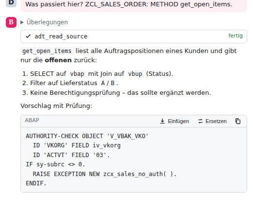
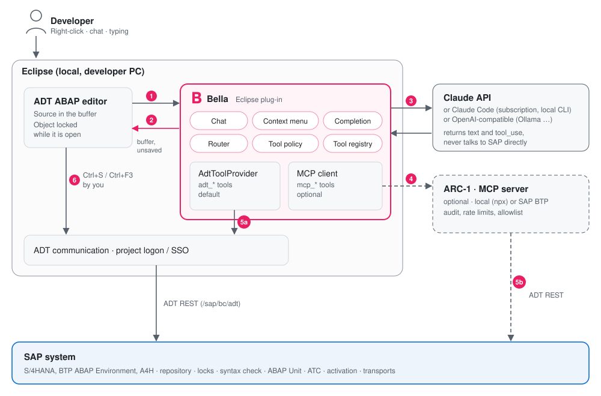
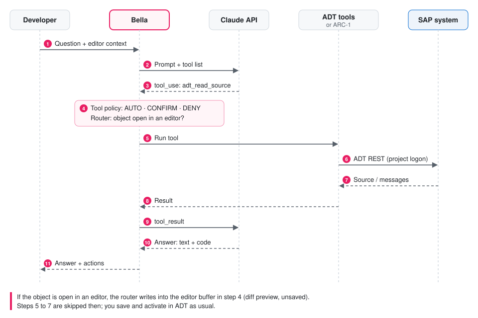

<p align="center"></p>

# Bella – KI-Assistentin für ABAP in Eclipse

Bella bringt Claude (oder ein anderes Sprachmodell) direkt in die ABAP Development Tools (ADT):

- Code erklären lassen
- im Chat arbeiten
- Code direkt in Methoden und Klassen schreiben lassen
- Inline-Vervollständigung

Bella greift über die vorhandene ADT-Anmeldung auf das SAP-System zu. Optional lässt sich ARC-1 anbinden. Die Oberfläche gibt es in 14 Sprachen.

*English summary at the end.*

<p align="center"></p>

## Funktionen

| | Funktion | Wo |
|---|---|---|
|  | **Was passiert hier?**: erklärt die Markierung oder, ohne Markierung, die Methode am Cursor | Rechtsklick im Editor → Bella |
|  | **Code hier generieren…**: schreibt Code an der Cursorposition | Rechtsklick → Bella |
|  | **Markierung überarbeiten…**: Fehler beheben, moderne Syntax, ABAP Cloud, Performance, Kommentare | Rechtsklick → Bella |
|  | **Methode implementieren**: schreibt den Rumpf von METHOD/FORM/FUNCTION am Cursor | Rechtsklick → Bella |
|  | **KI-Vervollständigung** als grauer Ghost-Text; Tab übernimmt, Esc verwirft | `Strg+Alt+Leertaste` oder automatisch |
|  | **Refactoring / Unit-Test vorschlagen** | Rechtsklick → Bella (Chat) |
|  | **Chat** mit Editor-Kontext, Streaming, Tool-Aufrufen; Codeblöcke per Button oder Rechtsklick einfügen, ersetzen oder als Methode übernehmen | `Strg+Alt+B`, Toolbar-B, Menü *Bella* |
|  | **SAP-Tools**: suchen, lesen, Verwendungsnachweis, Syntaxcheck (auch für ungesicherten Code), ABAP Unit, ATC, schreiben, anlegen, aktivieren | automatisch im Chat |

### Grundregel: geöffnete Objekte werden nur im Editor geändert

- **Code für eine geöffnete Methode oder Klasse landet nur im Eclipse-Editor**, nie direkt im SAP-System. Das Objekt ist durch den Editor gesperrt.
  - Vorher zeigt eine Diff-Vorschau alt und neu nebeneinander (abschaltbar).
  - Danach ist der Editor „dirty“: nicht gesichert und nicht aktiviert. Ein `Strg+Z` macht die Änderung rückgängig.
  - Sichern und Aktivieren machst du wie gewohnt mit `Strg+S` und `Strg+F3`.
- Will Claude im Chat ein offenes Objekt über ein Tool ändern, leitet Bellas **Router** den Schreibzugriff in den Editor um.
- **Nicht geöffnete Objekte** darf Bella im SAP-System schreiben, anlegen und aktivieren, nach deiner Bestätigung.

## Architektur: wer ruft wen auf

<p align="center"></p>

1. und 2. Bella liest den Quelltext aus dem ADT-Editor und schreibt Vorschläge nur in dessen Puffer.
3. **Nur Bella ruft das Sprachmodell auf.** Hin gehen Prompt, Code-Kontext und Tool-Liste, zurück kommen Text und `tool_use`-Anfragen.
4. Optional führt Bella Tool-Anfragen über ARC-1 oder einen anderen MCP-Server aus.
5. Tools erreichen das SAP-System auf einem von zwei Wegen:
   - **5a (Standard):** Bellas eigene `adt_*`-Tools laufen über die ADT-Kommunikationsschicht mit der Anmeldung deiner ABAP-Projekte (auch SSO). Es gibt kein zweites Login und keinen Zusatzprozess.
   - **5b (optional):** ARC-1 spricht mit dem SAP-System und bringt Audit, Rate-Limits und eine Paket-Allowlist mit.
6. Sichern und Aktivieren geöffneter Objekte machst du selbst in ADT.

**Die Claude API spricht nie direkt mit dem SAP-System.** Dein System muss nicht aus dem Internet erreichbar sein.

<p align="center"></p>

### Tool-Regeln

| Tool | Standard |
|---|---|
| Lesen (`adt_search_objects`, `adt_read_source`, `adt_where_used`, `adt_syntax_check`, `adt_run_unit_tests`, `adt_atc_check`, ARC-1: SAPRead, SAPSearch, …) | läuft automatisch |
| Schreiben, Anlegen, Aktivieren (`adt_write_source`, `adt_create_object`, `adt_activate`, ARC-1: SAPWrite, SAPActivate, …) | fragt nach |
| Transporte freigeben | wird immer abgelehnt |

- Eigene Regeln trägst du unter *Einstellungen → Bella → SAP-Tools & ARC-1* ein, eine pro Zeile im Format `muster=AUTO|CONFIRM|DENY`.
- Bei ARC-1 gelten zusätzlich dessen serverseitige Sicherheitsflags.

## Installation

Voraussetzungen:
- Eclipse 2024-12 oder neuer mit Java 21
- SAP ABAP Development Tools
- unter Linux zusätzlich WebKitGTK (`libwebkit2gtk-4.1`) für den Chat

1. Update-Site bauen oder aus dem CI-Artefakt `bella-update-site` herunterladen (siehe unten).
2. In Eclipse: *Help → Install New Software… → Add… → Local/Archive* und die Update-Site auswählen.
3. Beide Features installieren:
   - **Bella**: Chat, Editor-Aktionen, Vervollständigung, MCP/ARC-1.
   - **Bella ADT integration**: eigene SAP-Tools über die ADT-Anmeldung. Benötigt ADT.

## Einrichtung

*Window → Preferences → Bella*

- **Claude**:
  - API-Key von [console.anthropic.com](https://console.anthropic.com/settings/keys) eintragen. Er liegt verschlüsselt im Secure Storage von Eclipse.
  - Standardmodelle: `claude-opus-5` für Chat und Code, `claude-haiku-4-5` für die schnelle Vervollständigung.
  - Aufwand (*effort*) und die serverseitige Ersatzmodell-Option bei abgelehnten Anfragen sind einstellbar.
- **OpenAI-kompatibel** (optional): Basis-URL, Key und Modell, z. B. `http://localhost:11434/v1` für Ollama. Damit bleibt der Quelltext im Haus.
- **Sprachen**:
  - Oberfläche: wie Eclipse oder fest.
  - Antworten: wie die Oberfläche, wie die Frage oder fest.
  - ABAP-Kommentare im generierten Code: eigene Einstellung, Standard Englisch.
- **Editor**: Diff-Vorschau, automatische Vervollständigung beim Tippen und deren Verzögerung.

### ARC-1 anbinden (optional)

Unter *Preferences → Bella → SAP-Tools & ARC-1 → Hinzufügen…*:

- **HTTP**: URL des ARC-1-Servers, z. B. lokal `http://localhost:3000/mcp` oder eine BTP-Instanz, dazu optional ein Bearer-Token.
- **stdio**: Bella startet ARC-1 selbst, z. B. mit `npx -y arc-1@latest`. Die SAP-Verbindung konfigurierst du dann nach der [ARC-1-Doku](https://github.com/arc-mcp/arc-1).

Mit **Testen** siehst du die angebotenen Tools. Bei gleichen Fähigkeiten (z. B. Quelltext lesen) gewinnen standardmäßig Bellas ADT-Tools. Du kannst auch ARC-1 bevorzugen, etwa wenn Governance zentral über ARC-1 laufen soll.

## Sicherheit und Datenschutz

- An den gewählten Modellanbieter gehen deine Frage, Quelltext-Ausschnitte aus dem Editor und Tool-Ergebnisse. Mit Ollama bleibt alles lokal.
- API-Keys und Tokens liegen im Eclipse Secure Storage, nicht in Klartext-Einstellungen.
- Bella öffnet nie selbst einen SAP-Logon. Tools nutzen nur Projekte, die bereits angemeldet sind.
- Schreibende Tools fragen nach, Transportfreigaben sind gesperrt, und offene Objekte werden nur im Editor geändert.

## Entwicklung

```bash
mvn verify                    # Core, UI, Unit-Tests (ohne SAP-SDK)
xvfb-run -a mvn verify        # dazu der Workbench-Smoke-Test unter Linux
mvn -Padt verify              # zusätzlich ADT-Bundle und Update-Site
                              #   (lädt ADT von tools.hana.ondemand.com)
python3 releng/i18n/generate.py   # Übersetzungen aus releng/i18n/*.py erzeugen
```

| Modul | Inhalt |
|---|---|
| `bundles/de.kiliantaubmann.bella.core` | ohne UI und ohne ADT: Anthropic- und OpenAI-kompatible Provider (Streaming, Tool Use, Prompt Caching), Tool-Registry und Tool-Regeln, MCP-Client (HTTP und stdio), Chat-Tool-Schleife, ABAP-Scanner, Prompts, ADT-REST-Client und `adt_*`-Tools |
| `bundles/de.kiliantaubmann.bella.ui` | Chat-View, Kontextmenü, Diff-Vorschau, Router, Ghost-Text, Einstellungen, Icons, Übersetzungen |
| `bundles/de.kiliantaubmann.bella.adt` | einzige Abhängigkeit zum ADT SDK: Projekte, Anmeldung und REST-Transport als OSGi-Service |
| `tests/…core.tests` | Unit-Tests für Provider, MCP, Tool-Schleife, ABAP-Scanner, ADT-Client, Übersetzungen |
| `tests/…ui.tests` | Workbench-Smoke-Test: Befehle, Chat, Einstellungen, Schreiben in den Editor ohne Sichern, Router, Sprachumschaltung |

Die Claude-Anbindung nutzt bewusst `java.net.http` statt des Anthropic-Java-SDK. So bleibt das OSGi-Bundle frei von OkHttp, Kotlin und Jackson.

### Stand und bekannte Grenzen

- Das **ADT-Bundle** baut nur in CI (`-Padt`), weil SAPs p2-Site aus der Entwicklungsumgebung nicht erreichbar war.
  - Zustandsbehaftete Sessions (für Sperren) und die Objektreferenz eines Editors liest es per Reflection.
  - Fehlt eine API in deiner ADT-Version, meldet Bella das im Chat. ARC-1 bleibt dann als Weg für die SAP-Tools.
- Die ADT-REST-Aufrufe (Suche, Quelltext, Verwendungsnachweis, Syntaxcheck, ABAP Unit, ATC, Sperren/Schreiben, Anlegen, Aktivierung) folgen den bekannten ADT-Endpunkten. Gegen ein echtes System sind sie noch nicht getestet.
- Die Übersetzungen außer Deutsch und Englisch sind maschinell erstellt. Korrekturen sind willkommen.

## English summary

Bella is a Claude-native AI assistant for ABAP development in Eclipse ADT:
- chat with editor context
- "what happens here?" explanations
- code generation, rework and method implementation written **into the editor buffer only** (nothing is saved or activated for objects that are open)
- inline ghost-text completion
- SAP tools (search, read, where-used, syntax check, ABAP Unit, ATC, write, create, activate) through your existing ADT logon, optionally complemented by ARC-1 or any MCP server

Other LLMs can be used through any OpenAI-compatible endpoint (OpenAI, Azure, Ollama, LM Studio). The UI is available in 14 languages. Build with `mvn verify`; the ADT integration and update site with `mvn -Padt verify`.

© 2026 Kilian Taubmann. All rights reserved.
